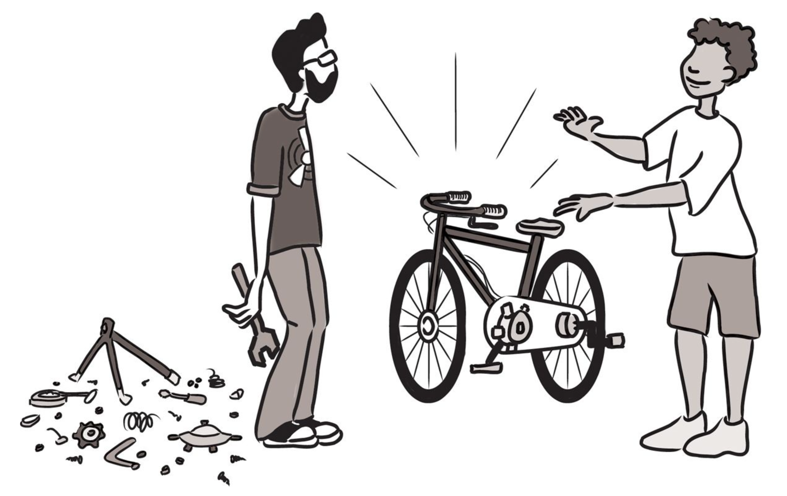
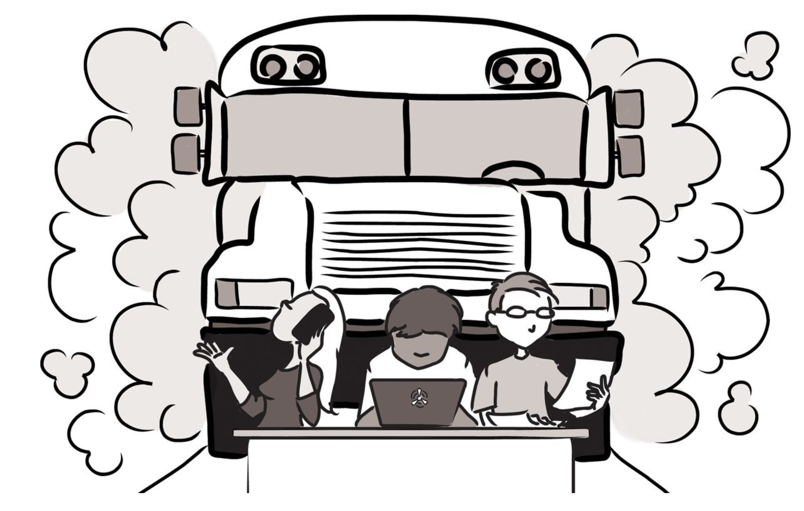

## مخفی کاری در برنامه نویسی، عامل ضرر و زیان
اگر شما تمام کارتون رو در خلوت تنهایی خودتون انجام بدین، دارین خطر شکست و همینطور احتمال عدم پیشرفت خودتون رو به شدت افزایش میدین. 

اولا، اصلا از کجا می دونین که شما در مسر درستی قرار دارین؟ 
 
تصور کنید شما یه سازنده و طراح دوچرخه هستید. یه روز یه ایده خارق العاده و ناب یه طرح تازه برای دنده دوچرخه به ذهنتون میرسه. قطعاتی که لازم دارین رو سفارش میدین و هفته ها توی کارگاهتون روی ساخت یه  نمونه کار سخت تلاش میکنید. وقتی همسایه شما، که اتفاقا او هم در ساخت دوچرخه سررشته داره ازتون در مورد کاری که دارین میکنید سوال می پرسه، شما چیزی رو توضیح نمیدین. شما نمیخواین که تا زمانی که کار شما کاملا و بی نقص تمام نشده، کسی در مورد این پروژه شما چیزی بدونه. چند ماه دیگه میگذره و شما برای ساخت نمونه کارتون دچار مشکل شدید. ولی خوب چون تمام این مدت رو مخفیانه کار کردین،‌ کمک گرفتن از دیگران در این مرحله دیگه غیرممکنه. یه روز ناگهان همسایه خودتون رو می بینید که دوچرخه خودش رو از پارکینگش بیرون میاره و روی دوچرخه اش یه دنده خیلی مدرن و خاص سوار کرده. کاشف به عمل میاد که اتفاقا اون هم داشته روی یه ایده خیلی مشابه به ایده شما کار می کرده ولی از چند نفر دیگه از دوستان و همکاران خودش هم کمک گرفته. اینجاست که شما دیگه اعصابتون به هم میریزه. کار خودتون رو به همسایتون نشون میدین و اون خیلی سریع به شما نشون میده که کارتون کجاها چه اشکالاتی داشته. اشکالاتی که احتمالا همون هفته اول میشد حلشون کرد اگر همون ابتدا همسایتون رو در جریان پروژتون گذاشته بودین.

چند تا نکته در این حکایت نهفته است. اگه شما ایده ناب خودتون رو از بقیه مخفی نگه دارین و از نشون دادن کار در حال پیشرفتتون به بقیه خودداری کنید، در حال قمار بزرگی هستید. اشتباهات اساسی در طراحی های اولیه خیلی به راحتی پیش میان. ممکنه که خیلی راحت دوباره چرخ رو اختراع کنید 
۱.
همچنین فواید استفاده از همکاری بقیه رو هم از دست میدین. دقت کردین که چطور همسایه شما دنده دوچرخه رو با کمک همکارهاش سریع تر از شما پیاده سازی کرد؟
 
مردم به همین دلیله که قبل ازینکه توی آب شیرجه بزنن، دمای آب رو چک میکنند. قبل از شروع هر کاری لازمه که مطمئن بشین که اولا شما دارین روی موضوع درستی کار میکنید،‌ ثانیا نحوه اجرای کارتون صحیحه، و ثالثا این کار قبلا انجام نشده. احتمال سوتی در ابتدای کار بسیار بالاست. هر چی بیشتر از بقیه نظرشون رو بپرسید،‌ احتمال اشتباهات اولیه رو کمتر میکنید۲.
 
اینکه کارتون رو از ابتدا با بقیه به اشتراک بذارین و نظرشون رو بپرسید، فقط باعث کاهش اشتباه و جلوگیری از کج رفتن نمیشه. بلکه باعث میشه خصوصیتی در پروژه اتون میشه که ما اسمش رو میذاریم:‌ ضریب اتوبوسی
۳!

ضریب اتوبوسی:‌ برابر است تا با تعداد افرادی که لازم است تا با یک اتوبوس تصادف کنند تا پروژه شما از بین بره. 

دانش و اطلاعات چقدر بین افراد تیمتون پخش شده؟‌ اگر شما تنها کسی هستین که جزئیات یه نمونه کار رو بلدین، درسته که ممکنه امنیت شغلی خوبی به نظر بیاد، ولی به این معنی هم هست که کل پروژه از بین خواهد رفت اگه یه روزی یه اتوبوس با شما برخورد کنه. 
 
ولی اگه شما و دوستتون با هم روی پروژه کار کرده باشید، عملا ضریب اتوبوسی پروژه رو دو برابر کردین. و اگه تونسته باشید که یه تیم رو در طراحی و پیاده سازی نمونه کار دخیل کنید، وضعیت شما بسیار بهتر خواهد بود. پروژه صرفا با ناپدید شدن یه نفر، از بین نخواهد رفت. درسته که احتمالا اعضای تیم خدایی نکرده با اتوبوس برخورد نخواهند کرد، ولی اتفاقات پیش بینی نشده دیگه ای ممکنه پیش بیاد. مثلا یه نفر ممکنه که ازدواج کنه، یا به شهر دیگه ای منتقل بشه، یا از شرکت استعفا بده، یا مجبور بشه از یه عضوی از خانواده که مریض شده مراقبت کنه. نکته بحث اینه که شما باید در مورد پروژه این آینده نگری رو داشته باشید و با بالا بردن ضریب اتوبوسی تیمتون، احتمال موفقیت پروژه رو افزایش بدین. 

صرف نظر از بحث ضریب اتوبوسی، مساله سرعت کلی کار هم حائز اهمیته. به راحتی میشه فراموش کرد که چقدر سرعت کار کردن تنهایی پایینه. خیلی پایین تر از میزانی که آدم ها دوست دارن بهش اعتراف کنند. وقتی تنها کار میکنید، چقدر چیز جدید یاد می گیرید؟ سرعت کارتون چقدره؟ اینترنت دنیای اطلاعاته، ولی به هیچ وجه جای تجربه انسان ها رو نمیگیره. کار کردن در تیم باعث میشه که خرد جمعی پشت یه پروژه افزایش پیدا کنه. وقتی روی یه مساله ای گیر میکنید، چقدر از وقتتون رو هدر میدین تا خودتون رو از چاله ای که توش افتادین بیرون بکشید؟ حالا به این فکر کنید که چقدر این تجربه متفاوت خواهد بود اگر چند نفر از همکاراتون کنار دستتون باشن و در لحظه بهتون بگن که کجا سوتی دادین و چطور می تونین مساله رو حل کنید. دقیقا به همین دلیله که تیم ها کنار دست هم میشینن 
(یا بصورت دو نفره برنامه نویسی میکنند)
.
بیشتر اوقات شما به یه جفت چشم دیگه نیاز خواهید داشت. 

بذارین یه مثال دیگه بزنم. فرض کنید شما در حال کد نویسی با یه زبان برنامه نویسی که 
compiler
داره هستید. آیا روزها میشینید و ده هزار خط کد می نویسید و وقتی مطمئن شدین که همه چیز رو کامل و بی نقص تمام کردین، دکمه کامپایل رو برای اولین بار فشار میدین؟! البته که نه!‌ چه فاجعه ای به بار میاد.
 
ما برنامه نویس ها با تغییرات کوچک که بتونیم سریع نتیجشون رو ببینیم، خیلی بهتر کار میکنیم. یه تابع بنویس، کامپایل کن، یه تست بهش اضافه کن، دوباره کامپایل کن، یکم کد رو تغییر بده، دوباره کامپایل کن. 
اشتباهات تایپی و اشکالات کد رو بالافاصله حل میکنیم. دائما نیاز داریم که به کامپایلر تکیه کنیم تا هوای ما رو داشته باشه. اینطوری می تونیم کیفیت کدمون رو بالا ببریم و نرم افزار رو کم کم بهتر و قوی تر کنیم. 

این نیاز به پیش بردن کار در تیکه های کوچک، نه فقط در سطح کدنویسی بلکه در سطح کل پروژه نیز وجود داره. 
پروژه های بلندپروازانه دائما در حال تطبیق به تغییرات اجتناب ناپذیری هستند که پیش می آیند. پروژه ها با موانع از قبل پیش بینی نشده ای برخورد می کنند یا گاهی اوقات کلا متوجه میشیم که هیچ چیز طبق برنامه ای که در نظر داشتیم پیش نمیره.
نیازهای پروژه به ناگاه تغییر میکنند. چطور ما می تونیم به سرعت برنامه ها و طرح هامون رو با تغییرات جدید تطبیق بدیم؟ جواب: با کار کردن بصورت تیمی. 

اریک ریموند یه جمله معروف داره:‌
> وقتی تعداد چشم ها زیاد بشن، باگ ها و ایرادهای نرم افزار نمایان میشن. 

شاید این جمله رو بشه کاملتر و بهتر اینطوری گفتش:‌ وقتی تعداد چشم ها زیاد بشن، پروژه شما از مسیر درستش خارج نمیشه.
 
آدم هایی که توی غار تنهایی خودشون کار میکنند، یه روزی بیرون میان و می بینن که با وجود این که کارشون رو به اتمام رسوندن، ولی دنیای بیرون غار تغییر کرده و ایده اولیه پروژه اشون دیگه توی این دنیای جدید معنی نمیده. 

---

#### مهندسین و دفترکار شخصی 
بیست سال پیش، ذهنیت کلی آدم ها این بود که یه اتاق شخصی که بشه درش رو بست بهترین مکان برای یه مهندسه که بتونه بالاترین کارایی رو داشته باشه. فرض و گمان اون زمان این بود که این دفتر شخصی، باعث میشه که یه برنامه نویس مدت زمان بیشتری رو بتونه برای خودش داشته باشه و فقط روی کد زدن تمرکز کنه. ولی ما فکر می کنیم نه تنها اتاق و دفتر شخصی برای بیشتر مهندسین نرم افزار اصلا ضروری نیست، بلکه حتی خطرناک هم هست. امروزه، نرم افزارها توسط تیم ها نوشته می شوند، نه اشخاص. و داشتن یه کانال ارتباطی قابل اتکا با سایر اعضای تیم، حتی از داشتن اتصال پرسرعت به اینترنت هم مهم تر و ضروری تره. تمام وقت دنیا رو هم  بدون مزاحم داشته باشی، اگر روی کار اشتباهی تمرکز کرده باشی، وقتت رو تلف کردی. 

متاسفانه به نظر میاد که شرکت های مدرن دنیای تکنولوژی، این روزها دیگه ازون ور بوم افتادند. وقتی وارد شرکت اونها میشین 50 یا حتی تا 100 نفر رو می بینین که دارن توی سالن های بسیار بزرگ در کنار هم کار می کنند. این طرح پلان آزاد و باز در دفاتر مهندسی این روزها موافق و مخالف های خودش رو داره. همه از کوچک ترین مکالمه ها خبردار میشن و آدم ها برای صحبت کردن احساس راحتی نمی کنند چون نگرانن که باعث اذیت و آزار بقیه بشن. این هم به اندازه دفترهای شخصی بده. 

ما معتقدیم که حد وسط این دو حالت واقعا بهترین راه حل باشه. تیم ها رو به گروه های 6 تا 12 نفره تقسیم کنید و هر تیم رو در اتاق مخصوص خودشون قرار بدین. اینطوری صحبتهای خود جوش راحت تر شکل میگیرن و کسی از حرف زدن خجالت نمی کشه و باعث آزار دیگران هم نمیشه. قطعا در این حالت هم مثل هر حالت دیگه ای، تک تک افراد همچنان نیاز دارن که جلوی سر و صداهای مزاحم رو بگیرن. به همین دلیله که کلی از آدم ها راه حل های خلاقانه ای پیدا کردند که باهاش بتونن به بقیه نشون بدن که الان توی کاری عمیق شدند و نمیخوان که کسی مزاحمشون بشه. یادمه ما توی یه تیمی کار میکردیم که بین خودمون یه قانون گذاشته بودیم که هر موقع هر کسی با کسی کار داشت اسمش رو صدا میکرد و میگفت Breakpoint. اگه اون فرد فرصت صحبت کردن داشت صندلیش رو بر میگردوند و با هم صحبت میکردند و اگه فرصت نداشت، میگفت Ack به این معنی که در اولین فرصتی که پیدا میکرد میومد و با همکارش صحبت میکرد. تیم های دیگه ای رو هم دیدیم که از هدفن های مخصوص Noise Cancellation استفاده می کردند تا سر و صدای محیط پیرامون رو حداقل کنند. در واقع کلا خود گذاشتن هدفون روی سر می تونه یه نشانه تلقی بشه ازین که "الان مزاحم من نشید، مگر اینکه کارتون خیلی واجبه". حتی تیم هایی رو هم دیدیم که از عروسک یا وسایل دیگه ای استفاده میکردند که باهاش نشون بدن که الان سرشون شلوغه و یا توی یه کاری عمیق شدند. 

منظور ما رو اشتباه متوجه نشید. بله ما معتقدیم که برنامه نویس ها نیاز به بازه های زمانی بدون وقفه و مزاحم برای عمیق شدن در برنامه نویسی دارند. ولی در عین حال عمیقا انتظار داریم که اون ها باید یه کانال ارتباطی قوی و همیشه در دسترس با سایر هم تیمی های خودشون داشته باشند. هنر واقعی، پیدا کردن حد وسط بین این دو نیازه. 

---

خوب نتیجه این شده که: ریسک تنهایی کار کردن ذاتا از کار کردن با بقیه بیشتره. 
به جای اینکه ازین نگران باشید که یه نفر ایده کار شما رو بدزده، یا نحوه کار شما رو قضاوت کنه، خیلی بیشتر باید ازین بترسید که وقتتون رو روی یه کار اشتباه تلف کنید. 
متاسفانه، مساله مخفی کردن ایده ها فقط محدود به رشته مهندسی نرم افزار نیست. این یه مشکل فراگیر توی همه رشته هاست. به عنوان نمونه، دنیای علم و دانش مثلا قراره که یه دنیای باز و آزاد از همکاری و تبادل اطلاعات باشه. ولی استیصال نیاز برای چاپ مقاله و رقابت برای دست یابی به بودجه های تحقیقاتی باعث نتیجه عکس شده. متفکران بزرگ ایده های خودشون رو با بقیه تقسیم نمی کنند. به سختی در تلاش برای پنهان کردن کارهاشون هستن و در غار تنهایی خودشون به تحقیق می پردازند و از ایرادهای کارشون بی خبر میمونند. نهایتا مقاله خودشون رو چاپ میکنند و طوری وانمود میکنند که انگار پشت کارشون تلاش و کوشش بی وقفه ای نبوده. و نتیجه ها عموما فاجعه بار هستند: یا به طور اتفاقی کار یه نفر دیگه رو تکرار کردند، یا کارشون ایرادهایی داره که متوجهش نبودند، و یا نهایتا کاری رو عرضه کردند که هر چند زمان شروع ناب و جالب بوده، ولی الان دیگه بی معنی و بی فایده هست. میزان زمانی که توی این کار تلف میشه، غم انگیزه. شما یکی مثل بقیه نباشید! 

---

۱ مخصوصا اگه واقعا سازنده دوچرخه باشید :) 

۲ البته نظرسنجی بیش از اندازه در ابتدای کار پروژه می تونه خطرناک باشه. در مورد این موضوع در فصل های آینده بیشتر صحبت خواهیم کرد. 

۳ Bus Factor

