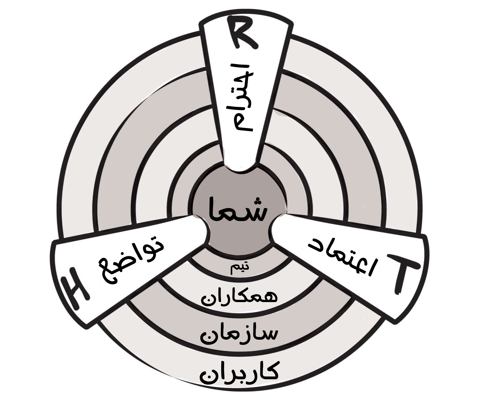

## ستون های سه گانه

پیش تر، منظورمان را از کار تیمی در مهندسی نرم افزار بیان کردیم. اگر کار تیمی، بهترین راه برای تولید قوی ترین نرم افزارهاست، چطور می توان یک تیم خوب را درست یا پیدا کرد؟ 
کار ساده ای نیست. برای رسیدن به مدینه فاضله در کار تیمی، ابتدا لازم است که سه مهارت اجتماعی که ما اسمشان را «ستون های سه گانه» میگذاریم را به خوبی یاد بگیرید و عمل کنید. این سه مهارت، فقط عامل روغن کاری چرخ های روابط اجتماعی نیستند. بلکه شالوده و بنیادی هستند که روابط تیمی سالم روی آنها استوار می شوند. 

تواضع: 
- شما مرکز دنیا نیستید. شما نه معصوم هستید و نه همه چیز دان. شما دیدِ بازی نسبت به بهبود شخصیت خود دارید.

احترام:
- شما از ته دل به همکارانتان اهمیت می دهید. با آنها مثل انسان رفتاری میکنید و قدر مهارت ها و دستاورد های آنها را می دانید.

اعتماد: 
- اطمینان دارید که سایرین، انسان های شایسته ای هستند که کار خودشان رو بلدند. شما به آنها این فرصت را می دهید که هرجا که مناسب بود اختیار امور را در دست بگیرند. 

به مجموعه این اصول سه گانه، به اختصار HRT 
۱
میگوییم و آن را هارت (Heart به معنی قلب) تلفظ میکنیم و نه هِرت (Hurt به معنی آسیب و درد). چرا که هدف از این اصول، کاهش درد و آسیب رسانی به یکدیگر است.

قضیه ای که ما در طول این کتاب سعی در اثباتش داریم به همین سه ستون بر میگردد: تقریبا ریشه تمام درگیری های ارتباطی در تیم ها را می شود در عدم یا کمبود حداقل یکی از اصول تواضع، احترام، و یا اعتماد پیدا کرد. ممکن است ادعای سنگینی به نظر بیاید، ولی بیشتر به آن فکر کنید. یک رابطه اجتماعی زشت که باعث ناراحتی شما در زندگی شده را به خاطر بیاورید. در بطن این مجادله، 
آیا همه طرفین به اندازه کافی فروتنی و تواضع به خرج دادند؟ 
آیا رفتار آدم ها با هم بر پایه احترام و ملایمت بود؟
آیا بین افراد دخیل در صحبت، احترام دو طرفه ای وجود داشت؟ 

این اصول برای ما آن چنان حائز اهمیت هستند که کل کتاب را بر اساس آنها طبقه بندی کرده ایم. کتاب با تمرکز روی شما شروع میشود تا شما را قانع کند که اصول HRT را درون خودتون تقویت کنید و آنها را مرکز توجهتان در ارتباطاتتان قرار دهید. فصل اول کتاب در همین راستاست. در فصل دوم درباره ساختن یک تیم بر اساس ستون های سه گانه HRT صحبت خواهیم کرد. سپس درباره ساختن فرهنگ تیمی صحبت می کنیم که نقطه ی عطفی در فرایند ساختن یک تیم رویایی است. در مرحله بعدی تمرکزمان را روی آن دسته از همکارهایی میگذاریم که اگرچه ممکن است عضوی از هسته اصلی تیم ما نباشند، ولی به طور روزانه با ما در ارتباط هستند. مثلا همکارانی که در تیم های دیگر کار میکنند یا داوطلبانی که صرفاً به پروژه ما کمک می کنند. خیلی از این افراد ممکن است نه تنها به اصول HRT پایبند نباشند، بلکه حتی شاید به طور اصولی انسان های سمی و خطرناکی باشند! اولین قدم این است که یاد بگیرید چطور تیمتان را در مقابل این دسته از آدم ها محافظت کنید. هدف نهایی خارج کردن نیش و دندان این آدم ها از فرهنگ تیمی شماست، که خود این کار می تواند یک راه حل عالی برای گسترش تیمتان باشه. 

خیلی از تیم ها، عضوی از یک شرکت بزرگ هستند که خود محیط و فرهنگ شرکت می تواند برایشان به اندازه آدم های سمی، دست و پاگیر و مخرب باشد. این که بلد باشیم که چطور بین موانع بازدارنده محیط یک شرکت مانور بدهیم، می تواند مستقیماً به روی موفقیت یا عدم موفقیت تولید یک محصول نرم افزاری تاثیر بگذارد.

و در نهایت، نباید کاربران نرم افزارتان را فراموش کنید. گاهی خیلی راحت وجود آنها را از یاد می بریم ولی کاربران، خون جاری در رگ های پروژه شما هستند. نرم افزار شما بدون افرادی که از آن استفاده کنند، هیچ هدف و مقصودی نخواهد داشت. تمام اصول HRT که باید بین افراد تیمتان رعایت کنید، دقیقاً در نحوه ارتباط شما با مشتری هایتان نیز صدق می کند. فواید این نحوه بازخورد با مشتری، شدیداً زیاد خواهد بود. 

یک لحظه توقف کنید! 

احتمالاً وقتی این کتاب را برداشتید، انتظار نداشتید که در حال ثبت نام در یک جور گروه حمایتی که هر هفته جلسات دور همی میگذارد باشید. درک می کنیم. سر کله زدن با مشکلات روابط اجتماعی گاهی اوقات میتواند سخت باشد. کار کردن با انسان ها معمولا آشفته، شلوغ، غیرقابل پیش بینی و آزاردهنده است. به جای تلاش برای برنامه ریزی و سیاست مداری در روابط اجتماعی، آدم وسوسه می شود که کلاً قضیه را فراموش کند. وقتی آدم می تواند با یک کامپایلر منطقی و قابل پیش بینی وقت بگذراند، چرا باید خودش را درگیر مسائل روابط اجتماعی بکند؟

توجه شما را به بخشی از سخنرانی معروف 
۲
ریچارد همینگ جلب می کنم: 

> با رفتار محترمانه، گفتن جوک و لطیفه و تلاش برای اینکه منشی من بخندد، کمک و سرویس فوق العاده بهتری دریافت میکنم. مثلاً یک روز به یک دلیل احمقانه یک سری سرویس در Murray Hill کار نمی کردند. نپرسید چرا، کار نمی کردند. من هم نیاز داشتم که یک کاری حتماً انجام شود. منشی من با یک نفر در Holmdel تماس گرفت، سوار ماشین شرکت شد، یک ساعت رانندگی کرد و کار مرا راه انداخت و برگشت. به نوعی جواب همه رفتارهای محترمانه من با او و تلاش های من برای خنداندنش را داد. به وسیله یادگیری و مطالعه دقیق یک سیستم، شما یاد میگیرید که چطور کاری کنید که سیستم در راستای اهداف شما کار کند. 

نصحیتی که دراین گفته نهفته این است: قدرت روابط اجتماعی را دست کم نگیرید. در مورد فریب کاری یا گول زدن افراد صحبت نمی کنیم. در مورد ساختن روابط مفید اجتماعی در راستای انجام دادن کارها صحبت میکنیم. همیشه عمر دوستی ها بیشتر از عمر پروژه ها خواهد بود. 

---

۱
حروف ابتدای کلمه انگلیسی برای هر یک از این سه ستون. یعنی: Humility, Respect, Trust

۲ Richard Hamming - “You And Your Research” http://www.cs.virginia.edu/~robins/YouAndYourResearch.pdf

